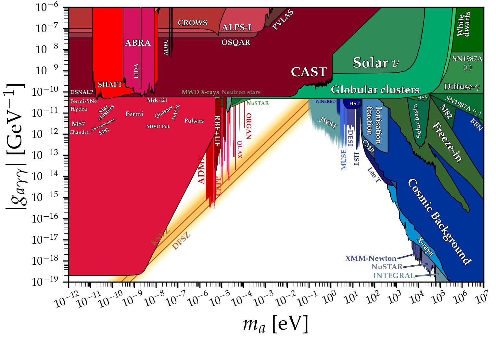
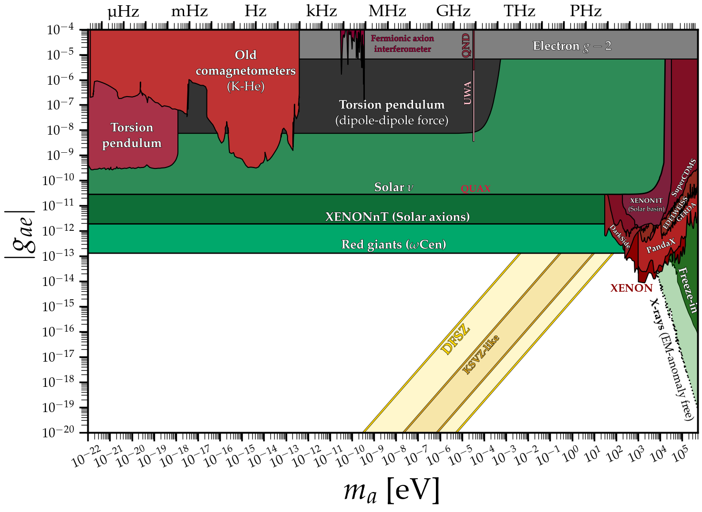
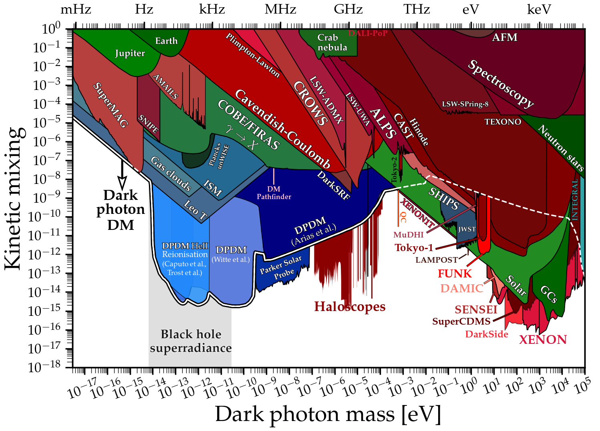

# Plot gallery, citations and credits

[Back to AutoAxionLimits](../README.md)

The guide below is retained from the upstream [AxionLimits project](https://github.com/cajohare/AxionLimits).

The purpose of this website is to host data files and python notebooks to create limit plots on axions, axion-like particles, dark photons, and other ultralight bosons. Please email me [ciaran.aj.ohare@gmail.com] if you have any questions/comments/complaints. I greatly appreciate corrections to anything here, no matter how minor or trivial. Please also inform me if a limit you have made isn't here, usually it will just be because I missed it. Also if you have made one of the limits shown here and it has been revised (e.g. in a v2 of the paper) please let me know as I am much more likely to have missed the update.

Please go to [refs/](../refs/README.md) to see a full list of all references, including a .tex and .bib file with all citation details collected from Inspire.

**Disclaimer:** the limits on this website here have been collected from an extremely wide array of papers (not all of them published) and from several different sub-fields. There may be wildly varying levels of uncertainty, assumption, model dependence, and importantly, differing levels of statistical rigour. There is not necessarily any fixed convention for what even constitutes a bound. This goes especially for experimental projections, which vary considerably in their respective levels of optimism. Therefore, one should exercise some caution when reading these plots: they are not intended to be the definitive word on the status of the axion. I more see them as a way to advertise the many ways one can search, and give a *rough* picture for what is allowed, what is ruled out, and what the community in general has been up to. Some may see my inclusion of certain bounds as being overly democratic, however I felt that it was important for this extremely active field to be fully reflected in these plots.

---

[](ap.md)

### [**Axion-photon coupling**](ap.md)
[**Data files**](ap.md)\
Plot ([pdf](https://github.com/cajohare/AxionLimits/raw/master/plots/AxionPhoton.pdf), [png](https://github.com/cajohare/AxionLimits/raw/master/plots/plots_png/AxionPhoton.png))\
Plot with projections ([pdf](https://github.com/cajohare/AxionLimits/raw/master/plots/AxionPhoton_with_Projections.pdf), [png](https://github.com/cajohare/AxionLimits/raw/master/plots/plots_png/AxionPhoton_with_Projections.png))\
Plot of dimensionless coupling ([pdf](https://github.com/cajohare/AxionLimits/raw/master/plots/AxionPhoton_Rescaled_NoProjections.pdf), [png](https://github.com/cajohare/AxionLimits/raw/master/plots/plots_png/AxionPhoton_Rescaled_NoProjections.png))\
Plot of dimensionless coupling with projections ([pdf](https://github.com/cajohare/AxionLimits/raw/master/plots/AxionPhoton_Rescaled.pdf), [png](https://github.com/cajohare/AxionLimits/raw/master/plots/plots_png/AxionPhoton_Rescaled.png))

---

[](ae.md)

### [**Axion-electron coupling**](ae.md)
[**Data files**](ae.md)\
Plot ([pdf](https://github.com/cajohare/AxionLimits/raw/master/plots/AxionElectron.pdf), [png](https://github.com/cajohare/AxionLimits/raw/master/plots/plots_png/AxionElectron.png))\
Plot with projections ([pdf](https://github.com/cajohare/AxionLimits/raw/master/plots/AxionElectron_with_Projections.pdf), [png](https://github.com/cajohare/AxionLimits/raw/master/plots/plots_png/AxionElectron_with_Projections.png))\
   &nbsp; \
  &nbsp; \
  &nbsp;

---

[](an.md)

### [**Axion-neutron coupling**](an.md)
[**Data files**](an.md)\
Plot ([pdf](https://github.com/cajohare/AxionLimits/raw/master/plots/AxionNeutron.pdf), [png](https://github.com/cajohare/AxionLimits/raw/master/plots/plots_png/AxionNeutron.png))\
Plot with projections ([pdf](https://github.com/cajohare/AxionLimits/raw/master/plots/AxionNeutron_with_Projections.pdf), [png](https://github.com/cajohare/AxionLimits/raw/master/plots/plots_png/AxionNeutron_with_Projections.png))\
   &nbsp; \
      &nbsp; \
  &nbsp;

---

[](app.md)

### [**Axion-proton coupling**](app.md)
[**Data files**](app.md)\
Plot ([pdf](https://github.com/cajohare/AxionLimits/raw/master/plots/AxionProton.pdf), [png](https://github.com/cajohare/AxionLimits/raw/master/plots/plots_png/AxionProton.png))\
Plot with projections ([pdf](https://github.com/cajohare/AxionLimits/raw/master/plots/AxionProton_with_Projections.pdf), [png](https://github.com/cajohare/AxionLimits/raw/master/plots/plots_png/AxionProton_with_Projections.png))\
   &nbsp; \
      &nbsp; \
  &nbsp;

---

[](at.md)

### [**Axion-top coupling**](at.md)
[**Data files**](at.md)\
Plot ([pdf](https://github.com/cajohare/AxionLimits/raw/master/plots/AxionTop_Collider.pdf), [png](https://github.com/cajohare/AxionLimits/raw/master/plots/plots_png/AxionTop_Collider.png))\
   &nbsp; \
   &nbsp; \
      &nbsp; \
  &nbsp;

---

[](cp.md)

### [**Axion CP-violating couplings**](cp.md)
[**Data files**](cp.md)\
Plot for scalar nucleon coupling ([pdf](https://github.com/cajohare/AxionLimits/raw/master/plots/ScalarNucleon.pdf), [png](https://github.com/cajohare/AxionLimits/raw/master/plots/plots_png/ScalarNucleon.png))\
Plot for electron-electron coupling ([pdf](https://github.com/cajohare/AxionLimits/raw/master/plots/MonopoleDipole_ElectronNucleon.pdf), [png](https://github.com/cajohare/AxionLimits/raw/master/plots/plots_png/MonopoleDipole_ElectronNucleon.png))\
Plot for nucleon-nucleon coupling ([pdf](https://github.com/cajohare/AxionLimits/raw/master/plots/MonopoleDipole_NucleonNucleon.pdf), [png](https://github.com/cajohare/AxionLimits/raw/master/plots/plots_png/MonopoleDipole_NucleonNucleon.png))\
   &nbsp; \
   &nbsp; \
      &nbsp;

---

[](aedm.md)

### [**Axion-EDM coupling**](aedm.md)
[**Data files**](aedm.md)\
Plot ([pdf](https://github.com/cajohare/AxionLimits/raw/master/plots/AxionEDM.pdf), [png](https://github.com/cajohare/AxionLimits/raw/master/plots/plots_png/AxionEDM.png))\
Plot with projections ([pdf](https://github.com/cajohare/AxionLimits/raw/master/plots/AxionEDM_with_Projections.pdf), [png](https://github.com/cajohare/AxionLimits/raw/master/plots/plots_png/AxionEDM_with_Projections.png))\
   &nbsp; \
      &nbsp; \
  &nbsp;

---

[](fa.md)

### [**Mass versus f_a**](fa.md)
[**Data files**](fa.md)\
Plot ([pdf](https://github.com/cajohare/AxionLimits/raw/master/plots/Axion_fa.pdf), [png](https://github.com/cajohare/AxionLimits/raw/master/plots/plots_png/Axion_fa.png))\
Plot with projections ([pdf](https://github.com/cajohare/AxionLimits/raw/master/plots/Axion_fa_with_Projections.pdf), [png](https://github.com/cajohare/AxionLimits/raw/master/plots/plots_png/Axion_fa_with_Projections.png))\
   &nbsp; \
      &nbsp; \
  &nbsp;

---

[](am.md)

### [**Axion DM predictions**](am.md)
[**Data files**](am.md)\
Plot ([pdf](https://github.com/cajohare/AxionLimits/raw/master/plots/AxionMass.pdf), [png](https://github.com/cajohare/AxionLimits/raw/master/plots/plots_png/AxionMass.png))\
   &nbsp; \
   &nbsp; \
   &nbsp; \
    &nbsp; \
        &nbsp; \
   &nbsp;

---

[](dp.md)

### [**Dark photons**](dp.md)
[**Data files**](dp.md)\
Plot ([pdf](https://github.com/cajohare/AxionLimits/raw/master/plots/DarkPhoton.pdf), [png](https://github.com/cajohare/AxionLimits/raw/master/plots/plots_png/DarkPhoton.png))\
   &nbsp; \
  &nbsp; \
   &nbsp; \
  &nbsp;

---

[](phie.md)

### [**Scalar-photon coupling**](phie.md)
[**Data files**](phie.md)\
Plot ([pdf](https://github.com/cajohare/AxionLimits/raw/master/plots/ScalarPhoton_with_Projections.png), [png](https://github.com/cajohare/AxionLimits/raw/master/plots/plots_png/ScalarPhoton_with_Projections.png))\
   &nbsp; \
  &nbsp; \
   &nbsp;

---

[](phime.md)

### [**Scalar-electron coupling**](phime.md)
[**Data files**](phime.md)\
Plot ([pdf](https://github.com/cajohare/AxionLimits/raw/master/plots/ScalarElectron_with_Projections.png), [png](https://github.com/cajohare/AxionLimits/raw/master/plots/plots_png/ScalarElectron_with_Projections.png))\
   &nbsp; \
  &nbsp; \
   &nbsp;

---

[](gBL.md)

### [**Vector B-L coupling**](gBL.md)
[**Data files**](gBL.md)\
Plot ([pdf](https://github.com/cajohare/AxionLimits/raw/master/plots/VectorB-L_with_Projections.pdf), [png](https://github.com/cajohare/AxionLimits/raw/master/plots/plots_png/VectorB-L_with_Projections.png))\
   &nbsp; \
  &nbsp; \
    &nbsp; \
   &nbsp;

---

[](fips.md)

### [**FIPS Workshop plots**](fips.md)
Plot ([pdf](https://github.com/cajohare/AxionLimits/raw/master/plots/AxionPhoton_FIPS.pdf), [png](https://github.com/cajohare/AxionLimits/raw/master/plots/plots_png/AxionPhoton_FIPS.png))\
   &nbsp; \
  &nbsp; \
   &nbsp; \
  &nbsp;

---

[](cs.md)

### [**Dark matter cheatsheet**](cs.md)
[**Data files**](cs.md)\
Plot ([pdf](https://github.com/cajohare/AxionLimits/raw/master/plots/Cheatsheet.pdf), [png](https://github.com/cajohare/AxionLimits/raw/master/plots/plots_png/Cheatsheet.png))\
   &nbsp; \
  &nbsp; \
   &nbsp; \
   &nbsp; \
  &nbsp; \
   &nbsp; \
      &nbsp; \
  &nbsp; \
   &nbsp; \
     &nbsp; \
   &nbsp; \
      &nbsp; \
  &nbsp;

---

[](https://github.com/cajohare/AxionLimits/raw/master/plots/Wavy_Map.png)
### **Experiment map**
Work in progress (comments welcome)\
Download [png image](https://github.com/cajohare/AxionLimits/raw/master/plots/Wavy_Map.png)\
Download [keynote file](https://github.com/cajohare/AxionLimits/raw/master/plots/Wavy_Map.key)\
  &nbsp;

---

If you use something here, you can give credit by citing the zenodo DOI attached to this repository
```
@misc{AxionLimits,
  author       = {Ciaran O'Hare},
  title        = {cajohare/AxionLimits: AxionLimits},
  month        = jul,
  year         = 2020,
  publisher    = {Zenodo},
  version      = {v1.0},
  doi          = {10.5281/zenodo.3932430},
  howpublished = {\url{https://cajohare.github.io/AxionLimits/}}
}
```


# Acknowledgements
**Thank you to**: Dorian Amaral, Abhishek Banerjee, Giovanni Barontini, Masha Baryakhtar, Joshua Benabou, Max Berbig, Asher Berlin, Itay Bloch, Aryaman Bhutani, Andrea Caputo, Pierluca Carenza, Raphael Cervantes, Yifan Chen, Raymond Co, Silvia Lucía Correa Angel, Bryce Cyr, Chris Dessert, Akash Dixit, Babette Döbrich, Jacob Egge, Xucheng Gan, Claudio Gatti, Sumita Ghosh, Maurizio Giannotti, Alexander Gramolin, Hartmut Grote, Jordan Gué, Xing Fan, Graeme Flower, Josh Foster, Jonas Frerick, Fred Hiskins, Taizhou Hong, Sebastian Hoof, Nick Houston, Derek Jackson-Kimball, Saarik Kalia, Heejoo Kim, Felix Kling, Stefan Knirck, Kazunori Kohri, Alessandro Lella, Chunlong Li, Hai-Jun Li, Jesse Liu, Jia Liu, Giuseppe Lucente, Jack Manley, Laura Manenti, Denis Martynov, Giacomo Marocco, David Marsh, Yuta Michimura, Javier Miguel Hernandez, Alex Millar, Viraf Mehta, Orion Ning, Thong Nguyen, Dion Noordhuis, Nadav Outmezguine, Bhanu Pant, Giovanni Pierobon, Sara Porras Bedmar, Pablo Quílez, Javier Redondo, Alessio Rettaroli, Andreas Ringwald, Nick Rodd, Giuseppe Ruoso, Gray Rybka, Ben Safdi, Subir Sarkar, Isaac Sarnoff, Jan Schuette-Engel, Ivo Schulthess, Robin Signoret, Julia Sisk-Reynes, Philip Sørensen, Konstantin Springmann, Stefan Stelzl, Haowen Su, Josh Tong, Fuminobu Takahashi, Mike Tobar, Maria Ubiali, Caner Ünal, Edoardo Vitagliano, Hanyue Wang, Arne Wickenbrock, Sam Witte, Samuel Wong, Huangyu Xiao, Xiao Xue, Byeongsu Yang, Wen Yin, Hojin Yoon and Kevin Zhou for comments, corrections and suggestions that have greatly helped improve these plots.
